# Real-time Shadows

## 目录
+ [Shadow Mapping](#shadow-mapping)
+ [The math behind shadow mapping](#the-math-behind-shadow-mapping)
+ [Percentage Closer Soft Filtering](#percentage-closer-soft-filtering)

## Shadow Mapping
贴一下 Games101 的 [Shadow Mapping](https://github.com/HL0817/Games101Notes/blob/main/Notes/7_8_9_Shading/Shading.md#%E9%98%B4%E5%BD%B1%E8%B4%B4%E5%9B%BE)
### SM 简介
+ A 2-pass Algorithm
    + The light pass generates the SM
    + The camera pass usrs the SM
+ 优缺点
    SM 是完全的图形空间算法
    + Pro: SM 可以作为场景中的几何表示来标记阴影关系，不在需要场景中的几何信息
    + Con: causing self occlusion and aliasing issues
+ SM 是一个非常出名的算法
    在光追能被离线渲染使用之前（离线渲染能容忍光追耗时之前），Toy Story(玩具总动员) 就使用 SM

### 基本过程
+ Pass 1:Render form light
从光源位置出发，沿着光照方向记录每一个像素的场景最近深度，写入贴图中
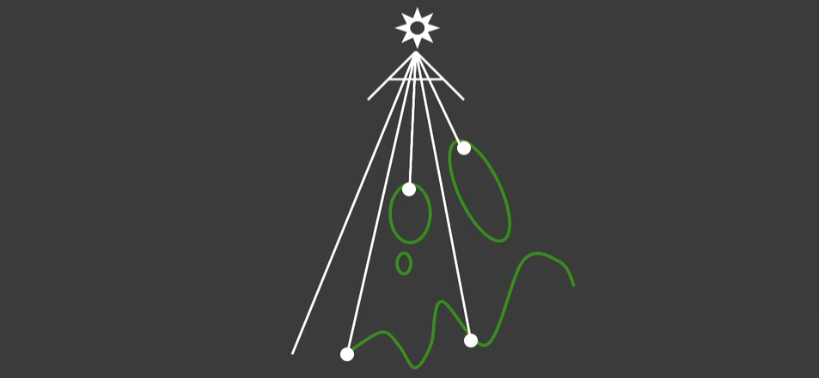
+ Pass 2:Render from Eye
从相机位置出发，渲染场景中的物体，将每个着色点在光源空间深度和 SM 中记录的最小深度作比较，着色点在光源空间深度更大时，着色点就在阴影中
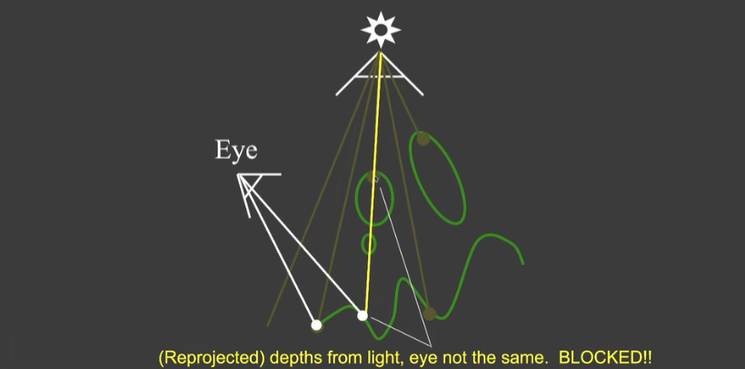
这里有个注意点，因为光源空间和相机空间的 MVP 不一样，需要在比较深度时做统一，通常是转换到光源空间作比较（在做投影时，挤压过程会将着色点推向远平面）

### SM 的结果
+ Compare with and without shadows
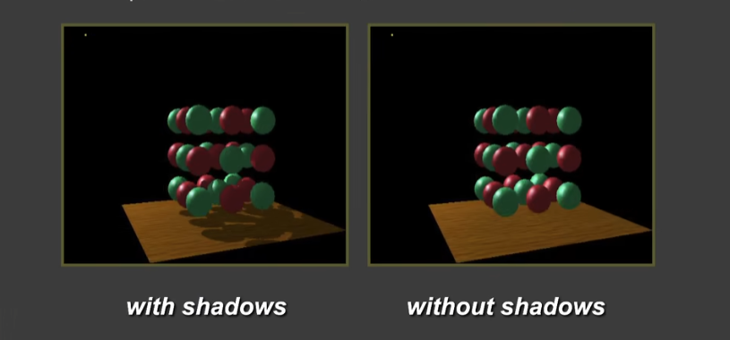
+ The scene form the light's point-of-view 同场景下，光源空间的观察结果
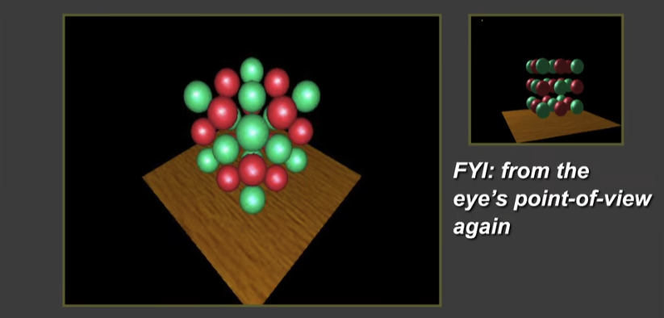
+ The depth buffer form the light's point-of-view 阴影贴图的输出结果
颜色越深，表示离光源越近
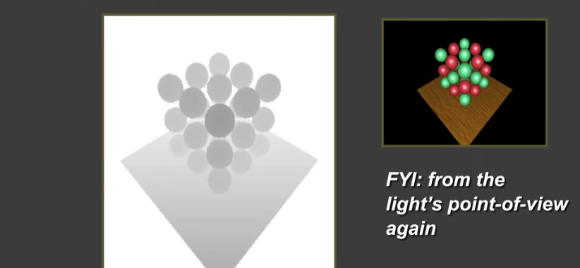

### Issues in Shadow Mapping
#### Self occlusion
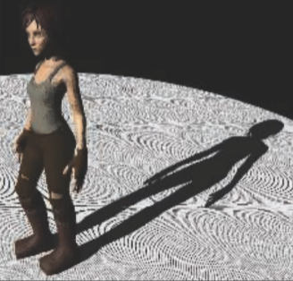
原始的 SM 会在地板上产生一圈一圈的纹路

原因很简单， SM 的这张贴图是有分辨率限制，每个像素都会表示场景中一块区域的深度，这块区域的深度被固定为了一个常数
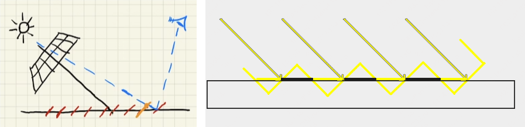
在场景中连续的深度关系被离散成了块状的常数深度关系，那么相邻块之间就有可能产生深度差，从而导致自遮挡（self occlusion）

一句话概括， SM 是离散的深度值，无法表示真实空间内连续的深度值

+ Bias and Peter Panning
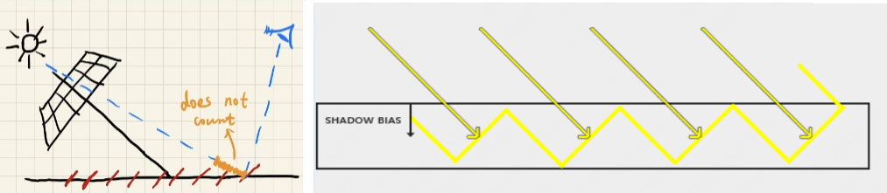
设置 bias 解决 Self occlusion 问题，我们人为的给相邻块的深度差设置一个容忍值 bias ，只要深度差小于 bias ，就认为没有出现遮挡（光照方向的夹角越小，自遮挡问题越严重，可以根据夹角大小灵活设置 bias）
Bias 可以解决自遮挡产生的条纹，但是， Bias 可能会造成新的问题 —— Peter Panning
因为 bias 设置过大，会使物体和阴影产生分离
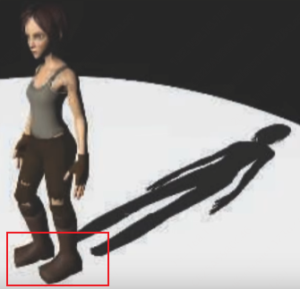
工业界没有真正解决这个问题，而是在场景中寻找合适 bias 值去减小问题，让阴影不和物体分离，且不会产生自遮挡

+ Second-depth shadow mapping
记录最小深度和次小深度解决 Self occlusion 问题
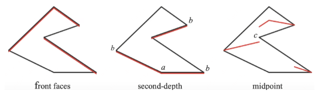
最小和次小深度做平均，将均值作为场景深度比较的依据
和原本的算法比，这个算法多了一次寻找次小深度的开销，算法的时间复杂度虽然仍是 O(n) 但是像素太多了，并不能被实时的要求给接受，**实时渲染不相信复杂度（RTR does not trust in COMPLEXITY）**

#### Aliasing
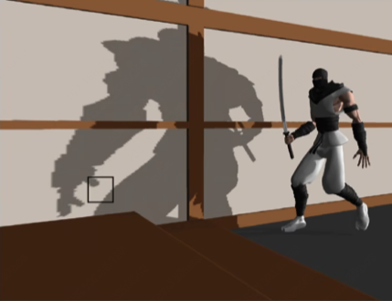
如果 shadow map 的精度不够，就会发生阴影走样
工业界有 Cascaded 方法，通过级联的方式减弱阴影的锯齿，但课程不涉及

## The math behind shadow mapping
### Calculus
+ 微积分中有许多有用的不等式
如果 $f(x)$ 和 $g(x)$ 在 $[a, b]$ 上都可积，那么有：
（Schwarz不等式）$\large \displaystyle [\int_{a}^{b}f(x)g(x)dx]^2 \leqslant \int_{a}^{b}f^2(x)dx \cdot \int_{a}^{b}g^2(x)dx$
（Minkowski不等式）$\large \displaystyle \{\int_{a}^{b}[f(x) + g(x)]^2dx\}^{\frac 1 2} \leqslant [\int_{a}^{b}f^2(x)dx]^{\frac 1 2} + [\int_{a}^{b}g^2(x)dx]^{\frac 1 2}$
+ Approximation in RTR
在 RTR 领域里，我们更关注不等式中相等或近似相等条件，即把不等式当做近似相等来使用（在一些条件下）
+ An important approximation throughout RTR
介绍一种 RTR 领域重要的常用的不等式，将乘积的积分近似为积分的乘积
$\large \displaystyle \int_{\Omega}f(x)g(x)dx \approx \frac {\int_{\Omega}f(x)dx} {\int_{\Omega}dx} \cdot \int_{\Omega}g(x)dx$
    + 分母的意义是什么？
    为了将两边的数量级约束在同一个水平内（保证大致能量守恒或保证数量级上能量相似），给近似式一个常数约束
    举一个例子，如果 $f(x) = 2, 积分限[a, b] = [0, 3]$ 那么 $\int_{0}^{3}2g(x)dx = 2\int_{0}^{3}g(x)dx = \frac {\int_{0}^{3}2dx} {\int_{0}^{3}dx} \cdot \int_{0}^{3}g(x)dx = \frac{6}{3}\int_{0}^{3}g(x)dx = 2\int_{0}^{3}g(x)dx$
    + 近似式的准确的条件
        + 积分域（support）小
        + $g(x)$ 在积分域内足够光滑，变化不大
+ 对渲染方程做近似，将可见性分离到着色之外
$\displaystyle L_o(p, \omega_o) = \int_{\Omega+}f_r(p, \omega_i, \omega_r)L_i(p, \omega_i)\cos\theta_iV(p, \omega_i)d\omega_i$
近似可得：$\displaystyle L_o(p, \omega_o) \approx \frac{\int_{\Omega+}V(p, \omega_i)d\omega_i}{\int_{\Omega+}d\omega_i} \int_{\Omega+}f_r(p, \omega_i, \omega_r)L_i(p, \omega_i)\cos\theta_id\omega_i$
这样我们可以不考虑可见性对着色点直接做 shading ，在最后才考虑可见性
渲染方程准确近似的条件：
    + Small support (point / directional lighting)
    + Smooth integrand (diffuse bsdf / constant radiance area lighting)

## Percentage Closer Soft Filtering
### From Hard Shadows to Soft Shadows
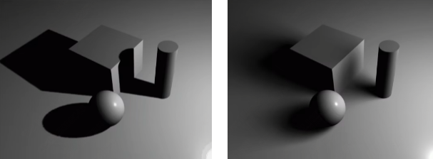
面光源会对物体产生一个半阴影区域，而这个区域就算软阴影区域
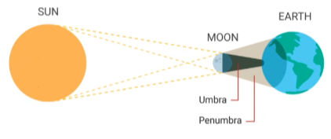

### Percentage Closer Filtering(PCF)
#### PCF 简述
PCF 最开始是作为阴影边缘抗锯齿的手段而提出，PCSS才是为了实现软阴影被提出的
#### PCF 基本过程
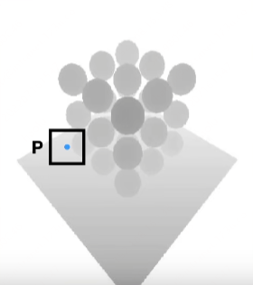
PCF是平均的思路，但不是对生成的 SM 做平均，也不是对着色点周围的深度做平均，而是在计算阴影时，对着色点周围深度比较后的结果做平均
+ Perform multiple depth comparisons for each fragment
对于这个着色点，采样周围的深度并分别做深度比较
+ averages results of comparisons
将周围所有深度比较的结果做平均，得到着色点的阴影均值
+ e.g.
    + 对着色点周围 $3 \times 3 $的像素做深度比较
    + 得到一组 $3 \times 3$ 的深度比较结果
    $\begin{pmatrix} 1 & 0 & 1 \\ 1 & 0 & 1 \\ 1 & 1 & 0 \end{pmatrix} $
    + 对深度比较结果做平均得到着色点的阴影值
+ PCF 的抗锯齿结果
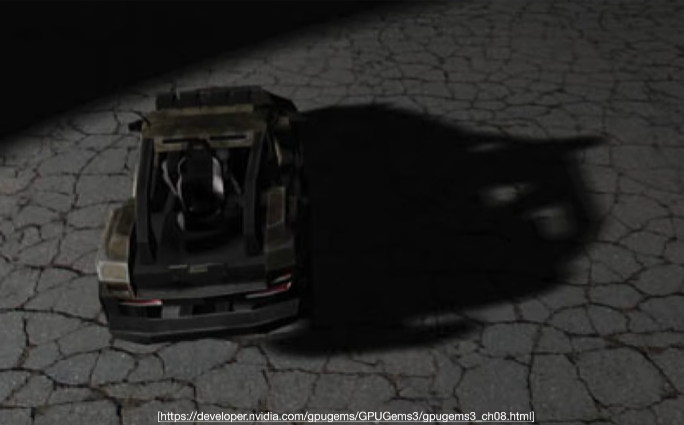
#### From PCF to PCSS
在实际使用 PCF 的过程中，我们会发现 filter size 是非常重要的
+ 小尺寸会使阴影变得锐利（棱角分明）
+ 大尺寸会使阴影变得柔和（棱角模糊）

如果对 PCF 做一些改进，就能实现软阴影 —— 对阴影使用不同尺寸的 filtering

分析一下什么时候使用软阴影，什么时候使用硬阴影

+ 阴影的接收物离阴影的投射物越近，阴影越硬
+ 阴影的接收物离阴影的投射物越远，阴影越软
那么，阴影的软硬和遮挡物的距离有关

用数学语言表示，$\large w_{Penumbra} = (d_{Receieve} - d_{Blocker} \cdot w_{Light} / d_{Blocker})$
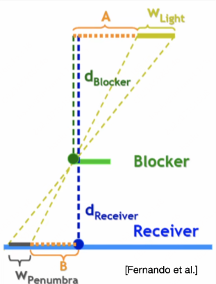
$\large w_{Penumbra}$ 表示阴影的柔和程度，越大越软

#### PCSS 基本过程
+ Step 1:Blocker search
在光源和着色点连线周围记录遮挡物的深度，并取出平均值
+ Step 2:Penumbra estimation
使用遮挡物平均深度算出这个着色点的 filter size
+ Step 3:Percentage Closer Filtering

为了算着色点的 filter size 我们在第一步中去了某个 size 来算计算遮挡物的平均深度，实际消耗上来说， PCSS 比固定大小的 PCF 更消耗性能一些

那么 blocker search 的 size 怎么取呢，我们使用一种启发式的方法来选取
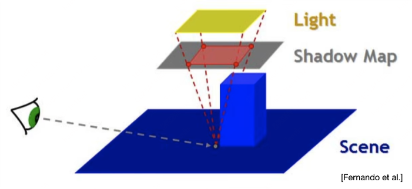
着色点连到光源，在 SM 上投影出来的 size 作为 blocker search 的范围

PCSS 的结果还是不错的
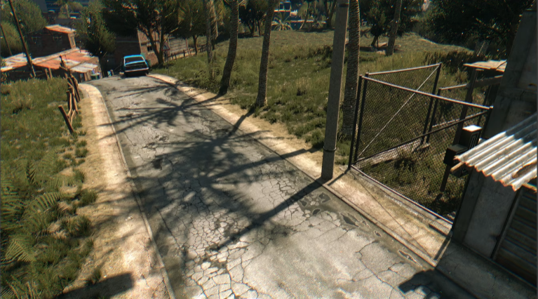
