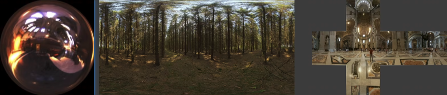
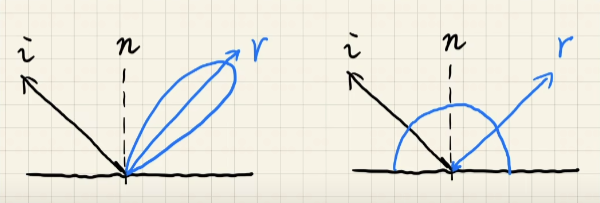
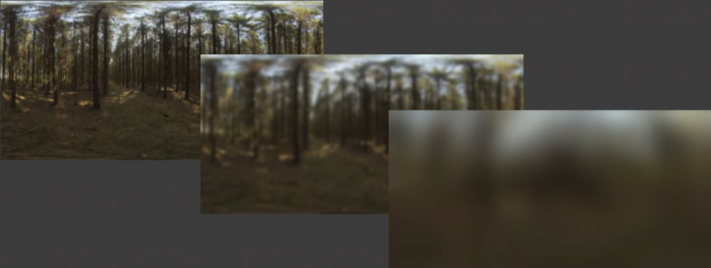
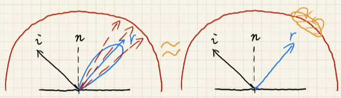
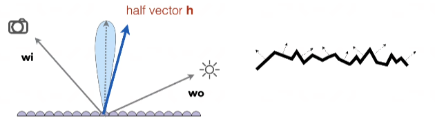
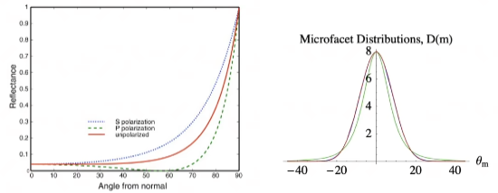
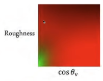
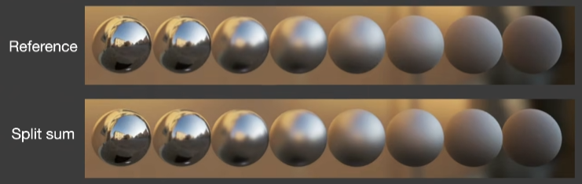
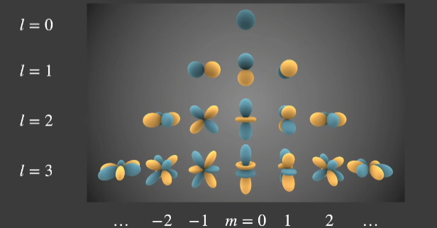
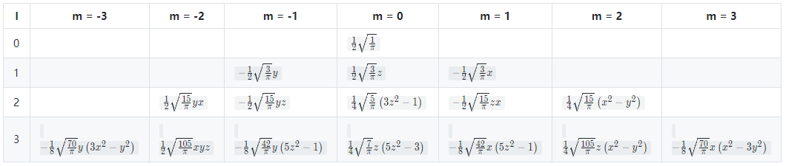

# Real-tiem Environment Mapping

## 目录
+ [Recap:Environment Lighting](#recapenvironment-lighting)
+ [Image-Based Lighting](#image-based-lighting)
    + [近似渲染方程](#近似渲染方程)
    + [光线积分简化和预处理](#光线积分简化和预处理)
    + [BRDF 积分简化和预处理](#brdf-积分简化和预处理)
    + [结果](#结果)

## Recap:Environment Lighting
环境光的定义：来自各个方向的远距离光照

由于被定义为远距离，所以对于所有着色点而言，这个光照的距离是固定的

因此，使用一个球形区域的表面来表示着色点不同方向的光照信息

一般使用 Spherical map 或 Cube map 来存储

## Image-Based Lighting
使用 Environment Lighting 对着色点进行着色，在工业界被称为 IBL(Image-Based Lighting)

### 近似渲染方程
还是从渲染方程出发，进行分析

$$\Large L_r(p, \omega_r) = \displaystyle\int_{H^2}f_r(p, \omega_i \rightarrow \omega_r) L_i(p, \omega_i) \cos\theta_i V(p, \omega_i) d\omega_i$$

首先不考虑阴影，只考虑着色本身

遮挡关系由 $V(p, \omega_i)$ 决定，我们先将这一项从渲染方程中摘出来，只考虑剩下的部分如何计算

$$\Large L_r(p, \omega_r) = \displaystyle\int_{H^2}f_r(p, \omega_i \rightarrow \omega_r) L_i(p, \omega_i) \cos\theta_i d\omega_i$$

剩下公式中表示，我们需要在着色点朝外的半球中积分 $L_i(p, \omega_i)$ 得到来自上半球各个方向的光线和 BRDF 项的相互作用

可以使用渲染方程求解的通用的解决方案 —— 蒙特卡洛积分，对着色进行计算
+ 无偏（Numerical）的求解方法
+ 需要大量的样本（样本越高，蒙特卡洛积分得到的数值越精确）

但蒙特卡洛积分并不能放到 shader 里进行积分求解（一般来说，靠样本采样的方法并不适合放到 shader 中做计算）

所以现在使用 IBL 的计算方法来对渲染方程做计算

对于渲染方程的 BRDF 项来说，其分布具有一定特殊的分布
+ glossy —— small support
+ diffuse —— smooth

毛玻璃材质的积分域比较集中，漫反射材质的积分函数比较平滑

这个特质非常适合使用一个近似式子

$$\large \displaystyle \int_{\Omega}f(x)g(x)dx \approx \frac {\int_{\Omega}f(x)dx} {\int_{\Omega}dx} \cdot \int_{\Omega}g(x)dx$$

BRDF 非常符合近似式的精确条件，所以使用它对渲染方程做近似分解

$\large \displaystyle L_r(p, \omega_r) \approx \frac {\int_{\Omega_{f_r}}L_i(p, \omega_i)d\omega_i} {\int_{\Omega_{f_r}}d\omega_i} \cdot \int_{\Omega^+}f_r(p, \omega_i \rightarrow \omega_r) \cos\theta_i d\omega_i$

其中 $\displaystyle L_i(p, \omega_i)$ 表示光照的输入（Environment Lighting）
$f_r(p, \omega_i \rightarrow \omega_r)$ 表示 BRDF 的分布

我们现在将 Environment Lighting 和 BRDF 给分开了

### 光线积分简化和预处理
对于 $\displaystyle L_r(p, \omega_r) \approx \frac {\int_{\Omega_{f_r}}L_i(p, \omega_i)d\omega_i} {\int_{\Omega_{f_r}}d\omega_i} \cdot \int_{\Omega^+}f_r(p, \omega_i \rightarrow \omega_r) \cos\theta_i d\omega_i$ 来说

其中的 $\displaystyle \frac {\int_{\Omega_{f_r}}L_i(p, \omega_i)d\omega_i}{\int_{\Omega_{f_r}}d\omega_i}$ 就表示对 Environment Lighting 的积分并归一化

也就是对 Environment Lighting 的那张图做模糊处理

我们可以对 Environment Lighting 这张图做滤波处理
+ 预生产不同 filtering size 的 environment lighting
+ 然后在实时计算中根据 size 三线性插值出需要的 environment lighting （这里类似 Mipmap 的思想）

最后根据反射方向对预处理后的 environment lighting 进行查询
+ 查询方向：镜面反射方向
+ 查询范围：实时计算出的 BRDF 的反射分布所覆盖的区域（这也是提前对 Environment Lighting 做 prefilter 的原因，区域查询时可以直接快速得到数值）

### BRDF 积分简化和预处理
回到近似后的渲染方程中来

$$\displaystyle L_r(p, \omega_r) \approx \frac {\int_{\Omega_{f_r}}L_i(p, \omega_i)d\omega_i} {\int_{\Omega_{f_r}}d\omega_i} \cdot \int_{\Omega^+}f_r(p, \omega_i \rightarrow \omega_r) \cos\theta_i d\omega_i$$

我们已经完成了第一部分（环境光照的归一化积分）的处理，现在来考虑近似后的渲染方程的第二个部分 —— BRDF 的积分

$\displaystyle \int_{\Omega^+}f_r(p, \omega_i \rightarrow \omega_r) \cos\theta_i d\omega_i$ 是物体表面的 BRDF 的积分，我们同样不能实时的使用蒙特卡洛采样来进行计算

和 Environment Lighting 的思路一样，还是寻求预计算来避免样本采样

我们可以假定着色对象的材质是固定的（比如玻璃、金属、毛玻璃等等），他们的 BRDF 由不同参数，如 roughness, color, Fresnel term, etc ，组成

如果我们有对应的这么多个表来查询所有不同参数组合出来的 BRDF 积分值，那么就可以快速计算出着色点的 BRDF 的积分值

但是参数维度过多，导致组合出来的需要预计算的 BRDF 积分值太多了（roughness * color * fresnel 就已经有 5 维了），因此我们需要对原积分式做简化

对微表面（Microfacet） BRDF 做简单的回顾

对于微表面模型来说，它的 BRDF 为 $\displaystyle f(\mathbf{i}, \mathbf{o}) = \frac {\mathbf{F(i, h)G(i, o, h)D(h)}}{4\mathbf{(n, i)(n, o)}}$

其中，
$\mathbf{F(i, h)}$ 是微表面模型的菲涅尔项，主要会决定物体的颜色
$\mathbf{G(i, o, h)}$ 是微表面模型的几何项，表示物体微小细节的几何信息，主要决定物体颜色的亮度（可以使用 AO 的想法来认识这一项），文中不提这个项的细节
$\mathbf{D(h)}$ 是微表面模型的法线分布（NDF），模型整体的法线分布由微表面的分布的大致走向所组成

菲涅尔项有一个经典的近似 —— The Schlick's approximation
$R(\theta) = R_0 + (1 - R_0)(1 - \cos\theta)^5$
$\displaystyle R_0 = (\frac {n_1 - n_2}{n_1 + n_2})^2$ 表示不同材质间的菲涅尔项的初始值
如下图（左）所示

NDF 项也有描述分布 —— e.g.Beckmann distribution
$\displaystyle D(h) = \frac {e^{-\frac{\tan^2 \theta_h}{\alpha^2}}}{\pi \alpha^2 \cos^4 \theta_h}$
$\alpha$ 表示这个分布的宽度（这个峰胖还是瘦），即材质粗糙还是光滑
类似于高斯分布，如上图（右）所示

对于不同的材质，可以只描述 $R_0$ 、 $\alpha$ 、 $\theta$ 来表示材质的整个 BRDF ，对这 3 个参数做组合预计算就可以从 5 维以上的组合降低到 3 维

再进一步，对 The Schlick approximation Fresnel 项做处理想办法把组合计算的维度给降低

$\displaystyle \int_{\Omega^+}f_r(p, \omega_i, \omega_o) \cos\theta_i d\omega_i$
$\displaystyle \approx \int_{\Omega^+} \frac {fr}{F}(R_0 + (1 - R_0)(1 - \cos\theta_i)^5) \cos\theta_id\omega_i$
$\displaystyle = R_0\int_{\Omega^+} \frac {fr}{F}(1 - (1 - \cos\theta_i)^5) \cos\theta_id\omega_i + \int_{\Omega^+} \frac {fr}{F}(1 - \cos\theta_i)^5 \cos\theta_id\omega_i$

我简单推一下这几步，首先假设子项也是可积的，令 $t = (1 - \cos\theta_i)^5$
$\int_{\Omega^+} \frac {fr}{F}(R_0 + (1 - R_0)(1 - \cos\theta_i)^5) \cos\theta_id\omega_i$
$= \int_{\Omega^+} \frac {fr}{F}(R_0 + (1 - R_0)t) \cos\theta_id\omega_i$
$= \int_{\Omega^+} \frac {fr}{F}(R_0 + t - tR_0) \cos\theta_id\omega_i$
$= \int_{\Omega^+} \frac {fr}{F}(R_0 \cdot (1 - t) + t) \cos\theta_id\omega_i$
由于子项可积分，可得原始
$= \int_{\Omega^+} \frac {fr}{F}(R_0 \cdot (1 - t)) \cos\theta_id\omega_i + \int_{\Omega^+} \frac {fr}{F}(t) \cos\theta_id\omega_i$
$= R_0 \cdot \int_{\Omega^+} \frac {fr}{F}((1 - t)) \cos\theta_id\omega_i + \int_{\Omega^+} \frac {fr}{F}(t) \cos\theta_id\omega_i$
把原式带入就得证

现在将 $R_0$ 拆到了积分之外，所以 BRDF 积分的组合计算的维度再降低 1 维，现在只需要 roughness（上文中的 $alpha$ 的所在项）和 $\cos\theta_i$ 的所有组合的积分值，就可以快速得到 BRDF 的值，2 维的组合表就是一张图片

$\displaystyle \int_{\Omega^+}f_r(p, \omega_i, \omega_o) \cos\theta_i d\omega_i \approx R_0\int_{\Omega^+} \frac {fr}{F}(1 - (1 - \cos\theta_i)^5) \cos\theta_id\omega_i + \int_{\Omega^+} \frac {fr}{F}(1 - \cos\theta_i)^5 \cos\theta_id\omega_i$

两个积分项，分别对应预计算的两张 $Roughness · \cos\theta_i$ 的数值表，一般使用 2D 的图片进行存储（用一张图片的2个通道也可以）

### 结果
我们已经对渲染方程的近似式的两个部分都做了简化和预处理，将大量组合计算放到了离线去做，在实时计算光照的过程中已经去掉了耗时的样本采样，能快速计算出与完整计算结果相近的光照效果

渲染方程中对两个函数乘积的积分近似成两个函数分别积分之后的乘积的做法，在工业界有对应的称呼 —— The Split Sum Approximation

$$\displaystyle \frac{1}{N} \frac{L_i(\mathbf{I}_k) f(\mathbf{I}_i, \mathbf{v}) \cos\theta_{\mathbf{I}_k}}{p(\mathbf{I}_i, \mathbf{v})} \approx \Big( \frac{1}{N}\sum_{k = 1}^{N} L_i(\mathbf{I}_k)\Big) \Big( \frac{1}{N} \frac{ f(\mathbf{I}_i, \mathbf{v}) \cos\theta_{\mathbf{I}_k}}{p(\mathbf{I}_i, \mathbf{v})} \Big)$$

工业界里做积分，就是做 $N$ 个样本的求和

### 阴影处理
环境光来自于四面八方，那么处理阴影也有两种思路
+ 将环境光当做多光源问题进行处理
    每个光源都需要做一次 SM ，整体耗费和光源数量成正比
+ 将可见性 $V$ 的计算放到渲染方程计算过程中，用蒙特卡洛方法采样
    $V$ 项是最难以计算的，对于着色点来说，不同方向的光有着不同的可见性

游戏行业通常的做法 —— 为最亮的一个多个光源生成阴影

环境光阴影处理的相关研究（有时间可以看看）
+ Imperfect shadow maps
+ Light cuts
+ RTRT
+ Precomputed radiance transfer

## Precomputed Radiance Transfer
### Recap
[Fourier Transform and Fourier Series Expansion](https://github.com/HL0817/Games101Notes/blob/main/Notes/6_Antialiasing_and_Visibility/Antialiasing_and_Visibility.md#%E9%87%87%E6%A0%B7%E7%9A%84%E7%90%86%E8%AE%BA%E5%9F%BA%E7%A1%80)

$f(x) = \frac A 2 + \frac {2A\cos(t\omega)} {\pi} - \frac {2A\cos(3t\omega)} {3\pi} + \frac {2A\cos(5t\omega)} {5\pi} - \frac {2A\cos(7t\omega)} {7\pi} + \cdot\cdot\cdot$

任何一个函数都可以做傅里叶级数展开，也就是每个函数都可以写成 $\sin \cos$ 的线性组合

函数由一系列低频到高频的信息组成，而傅里叶级数展开的不同级数及其系数表示了不同频率的信息，也就是级数越高，越能还原原函数的高频细节

一个函数可以被表示为某一类函数的线性组合，这一类函数被称为基函数（basis function），这些基函数的前面都有各自的系数

[卷积和滤波](https://github.com/HL0817/Games101Notes/blob/main/Notes/6_Antialiasing_and_Visibility/Antialiasing_and_Visibility.md#%E5%8D%B7%E7%A7%AF%E4%B8%8E%E6%BB%A4%E6%B3%A2)
时域做卷积等价于在频域上做乘积

将对卷积和滤波的理解放到渲染方程的处理中了来

$$\displaystyle \int_{\Omega}f(x)g(x)dx$$

对于两个函数乘积+积分的操作，可以看做是两个函数在做卷积，也就是在做滤波操作

函数是低频信号，就意味着函数是平滑的或者值域变换较小的函数

两个函数对应的频谱，只要有一个是低频的，那么他们卷积之后的结果也是低频的

推到两个函数乘积后做积分的过程中来，乘积后做积分结果的频率由两个函数中频率较低的那个函数决定

**Basis Functions**
可以被用来表示其他函数的一系列函数集合被称为基函数，通式
$$f(x) = \sum_i c_i \cdot B_i(x)$$

前面提到的傅里叶级数，展开式中的一系列函数就是一种基函数

多项式级数展开式的一系列函数也是一种基函数

### Spherical Harmonics
球面谐波函数，[点击详细了解（知乎）](https://zhuanlan.zhihu.com/p/153352797)，简称球谐，接下来对球谐函数进行简单理解

简单理解球谐函数是被定义在球面上的一系列 2 维的基函数 $B_i(\omega)$
+ 2 维指极坐标下，球面的任意位置可以用两个参数来表示（可以类比地球的经纬度，任意经纬度可以定位地球表面的任意位置）

球谐基函数可以类比到傅里叶级数展式中的基函数

最常见的球谐可视化

$l$ 表示球谐基函数的级数（degree），即对应原函数的频率（由低到高）
$m$ 表示球谐基函数的阶数（order），即对应级数的基函数的次方（应该可以这样理解吧，m阶指连带勒让德公式的阶数，主要决定递归式里次方项）
其中我们需要关注的：(1) $m = 2l + 1$ (2) 前 l 次累计有 $2^l$ 项

为什么不用傅里叶级数展开或者多项式级数展开？
答：其他展开式可能导致还原的函数不连续，对应到图像上就是有缝；而球谐函数本身就是在球面上定义的函数，不会有不连续的问题

球谐函数由原函数化简转换为 $I$ 次连带勒让德方程，求解得到，这里比较数学，可以参考前文参考链接中的推导过程

我们只需要知道一点，$\displaystyle f(x) = \sum_{l = 0}^{\infty} \sum_{k = -l}^{l}P_{lm}(\cos\theta)e^{im\varphi} = \sum\sum K_l^mY_{lm}$

$K_l^m$ 是球谐系数， $Y_{lm}$ 是球谐基函数

如果将原函数 $f(\omega)$ 投影到球谐基 $B_i(\omega)$ 上，就可以得到唯一的球谐系数 $c_i$ ，即 $\displaystyle c_i = \int_{\Omega}f(\omega)B_i(\omega)d\omega$

在球谐基不变时，只要知道球谐系数，就能恢复出来唯一的一个原函数（是近似的原函数，因为展开过程就是近似过程，除非级数无穷大才能完全恢复）