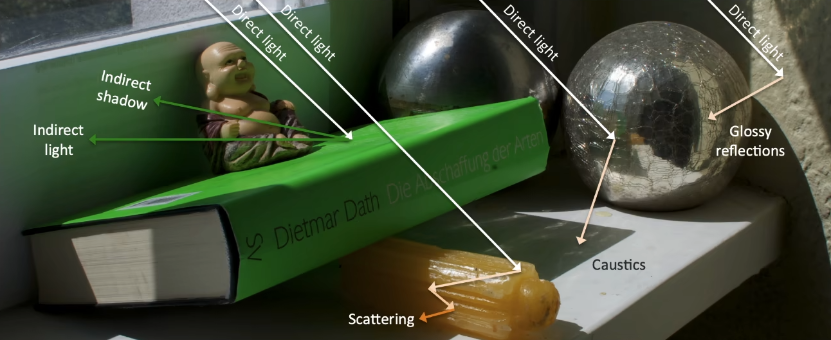
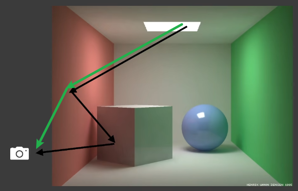

# Real-Time Global Illumination
Global Illumination (GI) 是对场景的渲染非常重要，但实现起来非常困难的光照类型

## Preknowledge
总所周知，光线追踪的光线弹射次数是无线的，不可能在实时渲染的时候使用无限次弹射的光线进行渲染

因此，在实时渲染领域，通常使用直接光照和弹射一次的间接光照来进行场景渲染，并将其称之为全局光照（GI）

即，GI = Direct illumination + one bounce indirect illumination

如下图所表示的两张光照
+ 直接光照（绿色）：由光源出发，打到物体后直接反弹到摄像机的光线
+ 一次弹射间接光照（黑色）：由光源出发，打到物体后经过一次弹射打到另一个物体，再反弹到摄像机的光线
    + 由光源发射照亮的第一个物体，这一段路径一般成为直接光照，不会计算弹射次数

实时光照有两个基本的，或者说需要接近的要求
+ 简单易实现
+ 快速

这两个要求也是后续讨论实时渲染的重要指标

## 目录
+ Reflective Shadow Maps
+ Light Propagation Volumes
+ Voxel Global Illumination